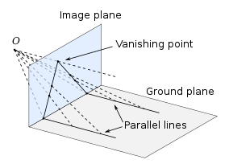
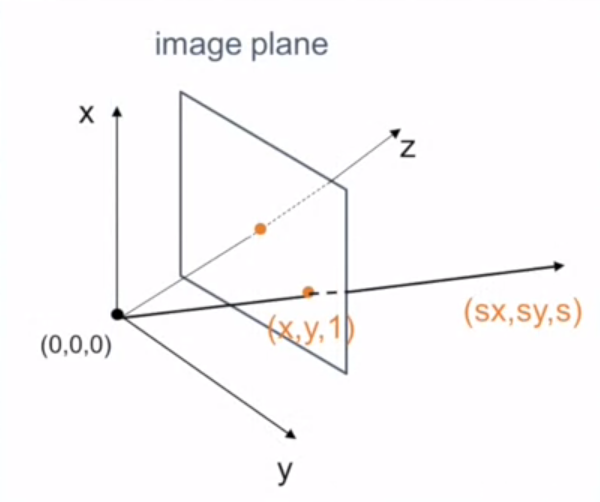

# Fundamentals

Images are just 2D arrays.
<br>Specifically objects of numpy arrays.

Images are made of pixels - individual cells of the array

Terms like VGA, HD, FulHD, 4k defined the size of image in pixels.

Videos are nothing just images flashed multiple time a second.

Binary Image : Image whose cells only have two values typically zero and one.

Usually black is denoted by 0 and white with 255, each image size being 8 bit long. 

Human eyes has three types of photoreceptor cells for color, kind of three types of sensors for perception and each sensor responds to RGB individually. 


# Perception

Birds like gannets determine the time to collision and not distance.

humans have telescopic visual system.

Primary components for cameras.
- Lens
- Imaging chip

Changing the focal length of the lens results in blurring of the image.

Increase the focal length and hhe felid of view decreases and the object magnifies, decrease the focal length and the field of view increases reducing the object size.   

Image plane is situated at the focal length of the camera.

**Intrinsic camera parameters**<br>
Intrinsic camera parameters refer to the internal characteristics and properties of a camera that are essential for capturing images. 

- Focal Length (f): The focal length is the distance between the lens and the image sensor when the lens is focused at infinity. It determines the magnification and field of view of the camera.

- Principal Point (or Optical Center): The principal point is the point where the optical axis intersects the image plane. It represents the center of the image and is crucial for correcting lens distortion.

- Pixel Aspect Ratio: This parameter describes the ratio of the width of a pixel to its height. It is necessary for accurately mapping pixel coordinates to physical dimensions.

= Lens Distortion Parameters: Distortion can occur due to imperfections in the camera lens. Common distortion types include radial distortion (caused by the curvature of the lens) and tangential distortion (resulting from the lens not being perfectly parallel to the image plane). Distortion parameters are used to correct these distortions.


$$
\begin{bmatrix}
    x \\
    y \\
    1 \\
\end{bmatrix} =
\begin{bmatrix}
    a_xf & sf & p_x\\
    0 & a_yf &  p_y\\
    0 & 0 &  1\\
\end{bmatrix} 
\begin{bmatrix}
    x' \\
    y' \\
    z' \\
\end{bmatrix} 
$$

where x, y, z is point in image world (coordinates of object in the image) and x', y', z' is point in optical world (coordinates of the object wrt camera).<br>
a<sub>x</sub>, a<sub>y</sub> is the pixel scaling factor.<br>
p<sub>x</sub>, p<sub>y</sub> is the principle point, where optical axis hits the image plane (ideally center) <br>
s is the skew factor when image plan is not perpendicular to ideal image plane. <br>
f is the focal length of the camera

This matrix is also know as calibration matrix.

# Single View Geometry

To interpret the position of the camera by observing the orientation of objects within the image.

**Single View Measurement**

Unwrap the image to do measurements.

**Vanishing Point**

<p align="center">
	
</p>

Wiki - A vanishing point is a point on the image plane of a perspective rendering where the two-dimensional perspective projections of mutually parallel lines in three-dimensional space appear to converge. 

Vanishing points lie on horizon.

An image can have multiple vanishing point.

Any two  parallel lines have same vanishing point.

Height of the horizon in the image plane can used to deduce the height of the camera lifted in ground frame.

**Geometric intuition**

Homogenous coordinates

A point in the image is a ray in projective space. Association of a ray to a point. The origin is considered as the camera itself anf the image plane along the z-axis at unit distance.

<p align="center">
	
</p>

A line in the image plane can be considered as plane in the projective space.


# opencv

**Axis convention:**

```python
(0,0)
   --------→
   |
   |
   |
   ↓
```

**Color Spaces:**
- RGB => Red, Green, Blue
- BGR => Blue, Green, Red
- HSV => Hue, Saturation, Value

<p align="center">
	
</p>

**Operations:**
- Convert to greyscale
- Blur : Replace a pixel by the average of neighboring pixels 
- Edge detection : Canny Algorithm
- Dilation : Enlarge regions to make feature more prominent
- Erosion : Reduce features
- Thresholding
- Bitwise => AND, OR, NOT, XOR
- Masking

**Transformations:**
- Translations
- Rotations
- Flip
- Crop
- Resize

**Objects:**
- Generation of Image
- Lines
- Rectangles
- Circles
- Text

**Warp Perspective**<br>
Change the perspective of image


**Stack Images**

**Color Detection**

A good practice to convert RGB mode to HSV as HSV also takes lighting conditions into account.
<br>
Create a mask and filter out the colors using bitwise AND operation not wanted, that simple.

**Contour Detection**

Convert to GrayScale. To simply the process
<br>
Apply Blur if necessary to reduce noise
<br>
Apply edge detection

Or simply use findContours method.

Shapes can also be detected using contours.

Bounding Boxes are added to enclose the contours and display the object.

**Histogram**<br>
Distribution of pixel intensity in the image.

# Aruco Markers

Type of barcode like markers used for mostly calibration of camera and reference points for tracking and recognizing objects or positions in the real world.

ArUco markers are based on Hamming code.<br>
In the grid, the first, third and fifth columns represent parity bits. The second and fourth columns represent the data bits. Hence, there are ten total data bits.

A predefined dictionary is used for detection and generation of markers.

The dictionaries follow a specific naming convention NxN_M<br>
Where NxN defines the size of the marker in terms of gid cells and also bit size of information it contains so A 5x5 marker hsa 5x5 grd cell and contains 25 bit info, each cell represents a single bit

M represents the total unique markers will be generate.

Each pattern within the dictionary has a unique ID associated.

# Usage

Requirements:

```python
Python version: 3.10.12
Numpy version: 1.21.5
OpenV version: 4.6.0
Numpy path: /home/aditya/.local/lib/python3.10/site-packages/numpy/__init__.py
OpenV path: /home/aditya/.local/lib/python3.10/site-packages/cv2/__init__.py

```

```python
pip3 install opencv-contrib-python==4.6.0.66
```

Clone the repository.

```python
git clone git@github.com:maker-ATOM/Computer-Vision-for-Robotics.git
```

Move to root of directory.
```python
cd <path_to_cloned_directory>/fundamentals
```

Execute the script
```python
python3 read_data.py
```

If in any case
```python
pip3 uninstall opencv-contrib-python
pip3 uninstall opencv-python
sudo apt-get remove python3-numpy
```

Aruco Marker Generation site

```python
https://chev.me/arucogen/
```

# Resources

[Computer Vision Engineer](https://www.youtube.com/watch?v=eDIj5LuIL4A) | 
[Murtaza](https://www.youtube.com/watch?v=WQeoO7MI0Bs) |
[freecodecamp](https://www.youtube.com/watch?v=oXlwWbU8l2o) 