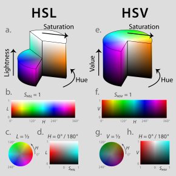

# Fundamentals

Images are just 2D arrays.
<br>Specifically objects of numpy arrays.

Images are made of pixels - individual cells of the array

Terms like VGA, HD, FulHD, 4k defined the size of image in pixels.

Videos are nothing just images flashed multiple time a second.

Binary Image : Image whose cells only have two values typically zero and one.

Usually black is denoted by 0 and white with 255, each image size being 8 bit long. 

Human eyes has three types of photoreceptor cells for color, kind of three types of sensors for perception and each sensor responds to RGB individually. 


# Perception

Birds like gannets determine the time to collision and not distance.

humans have telescopic visual system.

Primary components for cameras.
- Lens
- Imaging chip

Changing the focal length of the lens results in blurring of the image.

# Single View Geometry.

# opencv

**Axis convention:**

```python
(0,0)
   --------→
   |
   |
   |
   ↓
```

**Color Spaces:**
- RGB => Red, Green, Blue
- BGR => Blue, Green, Red
- HSV => Hue, Saturation, Value

<p align="center">
	
</p>

**Operations:**
- Convert to greyscale
- Blur : Replace a pixel by the average of neighboring pixels 
- Edge detection : Canny Algorithm
- Dilation : Enlarge regions to make feature more prominent
- Erosion : Reduce features
- Thresholding

**Transformations:**
- Translations
- Rotations
- Flip
- Crop
- - Resize

**Objects:**
- Generation of Image
- Lines
- Rectangles
- Circles
- Text

**Warp Perspective**

**Stack Images**

**Color Detection**

A good practice to convert RGB mode to HSV as HSV also takes lighting conditions into account.
<br>
Create a mask and filter out the colors using bitwise AND operation not wanted, that simple.

**Contour Detection**

Convert to GrayScale. To simply the process
<br>
Apply Blur if necessary to reduce noise
<br>
Apply edge detection

Or simply use findContours method.

Shapes can also be detected using contours.

Bounding Boxes are added to enclose the contours and display the object.

# Aruco Markers

# Usage

Requirements:

```python
Python version: 3.10.12 (main, Jun 11 2023, 05:26:28) [GCC 11.4.0]
Numpy version: 1.26.1
Opencv version: 4.7.0
```

```python
pip3 install opencv-contrib-python==4.4.0.46
```

Clone the repository.

```python
git clone git@github.com:maker-ATOM/Computer-Vision-for-Robotics.git
```

Move to root of directory.
```python
cd <path_to_cloned_directory>/fundamentals
```

Execute the script
```python
python3 read_data.py
```

If in any case
```python
pip uninstall opencv-contrib-python
```

```python
pip installation
Python version: 3.10.12 (main, Jun 11 2023, 05:26:28) [GCC 11.4.0]
Numpy version: 1.26.1
OpenV version: 4.8.1
OpenV path: /home/aditya/.local/lib/python3.10/site-packages/cv2/_init_.py

or esle:
Python version: 3.10.12 (main, Jun 11 2023, 05:26:28) [GCC 11.4.0]
Numpy version: 1.26.1
OpenV version: 4.5.4
OpenV path: /usr/lib/python3/dist-packages/cv2.cpython-310-x86_64-linux-gnu.so
```
# Resources

[Computer Vision Engineer](https://www.youtube.com/watch?v=eDIj5LuIL4A)
[Murtaza](https://www.youtube.com/watch?v=WQeoO7MI0Bs)
[freecodecamp](https://www.youtube.com/watch?v=oXlwWbU8l2o)